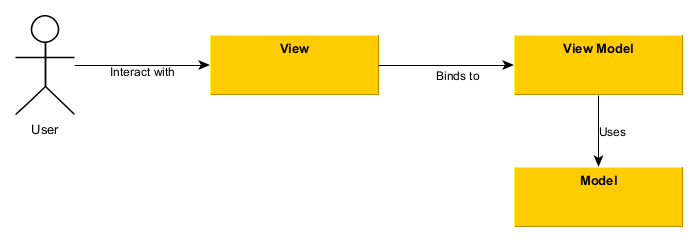

# Model - View - ViewModel

If you need to write simple WPF project then will be enough to use XAML with some [code-behind](https://docs.microsoft.com/en-us/dotnet/desktop/wpf/advanced/code-behind-and-xaml-in-wpf).
But for the bigger project we need the separate view from the logic and data.
Introduced by Microsoft, an MVVM architecture/design pattern is really great piece in development. 
As per the definition, MVVM is an abbreviation of three major components combined together, namely Model, View, and ViewModel.

## The Model

A Model in MVVM design pattern helps to represent the real-time data or information. A good example to understand this element will be a phone number with a person’s name and address.
The model represents the actual data and/or information we are dealing with. In most cases we try to use there [POCO](https://www.c-sharpcorner.com/UploadFile/5d065a/poco-classes-in-entity-framework/) classes.
Don't mix stored data with the view data. For sample if you store price in dollars but want to show it in dollar and euro then don't mix both columns together in one model class.

## The View

The View is the interface offered to the users in Model-View-ViewModel architecture. This element utilizes a set of elements to present the data more accurately and appropriately.
In addition, the View doesn’t have a stable or constant state of action. It synchronizes its behavior with the ViewModel.
View itself could contain complex elements like data grids but there must be no additional logic in code-behind.

## The ViewModel

The most essential element of MVVM architecture is ViewModel, which support the View part separately from the Model. This element makes the Model hold the actual data, and the View part holds the formatted or updated data. ViewModel hold the logic and introduce the interface between View and Model. Pay attention that ViewModel is only the glue between all parts. Buisness logic must be seperated in additional classes.

But again - all of this recomendation only, depends of real projects you can choose the different behaviour.

## MVVM advantages
- separation between the View and Model. It is possbile to use Model and ViewModel without View for test purpose.
- distribute responsibilities between classes in a GUI application
- Model and ViewModel do not need to exist from the start and can be introduced when they are needed.
- the View can be very simple.
- the code in the Model and the ViewModel can be put under Unit Test.
- the designer can work undependetly from your code

## MVVM disadvantages

- for trivial projects MVVM is too complex
- can hurt application performance